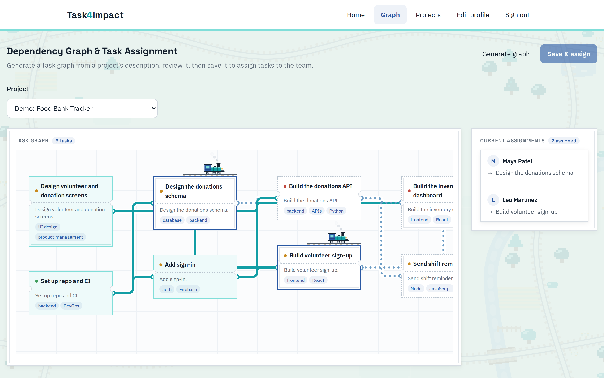

# Task4Impact

A web app for kicking off Hack4Impact projects. Members keep a profile of what they're good at and what they want to learn. A PM/TL pastes in a project description, Gemini drafts a task dependency graph, and once the graph is saved, every task that's ready goes to the best-fit teammate who's free. Checking off a task unblocks whatever depends on it, and those tasks get assigned next.

**Live:** https://hackintroproject.web.app (the free backend sleeps when idle, so the first load can take about 30 seconds)



## How it works

- **Profiles.** Strengths and interests come from one shared tag list, so matching a person to a task is exact tag overlap. Seniority (newbie or oldie) also feeds the score.
- **Generation.** Gemini returns structured JSON. The backend rejects drafts with cycles, dependencies on tasks that don't exist, duplicate ids, or tags outside the list, and asks again. Nothing is saved until someone reviews the draft.
- **Assignment.** OR-Tools' CP-SAT solver hands ready tasks to idle project members. It first assigns as many people as task capacity allows, then maximizes fit: skill overlap, seniority against difficulty, and how much downstream work a task is holding up.
- **The loop.** Saving a graph, checking off a task, or someone joining or leaving a project reruns assignment. Editing a graph keeps progress on every task that survives the edit.

## Stack

React and Vite on Firebase Hosting, a Flask API on Render, Firestore, Firebase Auth, Gemini, and OR-Tools.

## Running it locally

Backend (Python 3.12):

```bash
cd backend
python3 -m venv .venv && .venv/bin/pip install -r requirements.txt
.venv/bin/python app.py   # serves on port 5001
```

It needs two gitignored files in `backend/`: `firebase-service-account.json` (Firebase console → Project settings → Service accounts) and a `.env` with `GEMINI_API_KEY=...`.

Frontend:

```bash
cd frontend
cp .env.example .env && npm install && npm run dev
```

`backend/seed.py` loads a demo project with six fake members. [CLAUDE.md](CLAUDE.md) has the data model, every API route's request and response, and the deploy steps.

## Team

Built by Anna Ekmekci, David Halsey, Jonah Fishman, and Tiffany Xiao for the Hack4Impact intro project.

- **Anna:** task generation with Gemini, the assignment solver, the dependency graph view
- **David:** Firebase sign-in, the graph page
- **Jonah:** backend API and data layer, profile and task routes, deployment
- **Tiffany:** UI and visual design, the home/projects pages and routes
